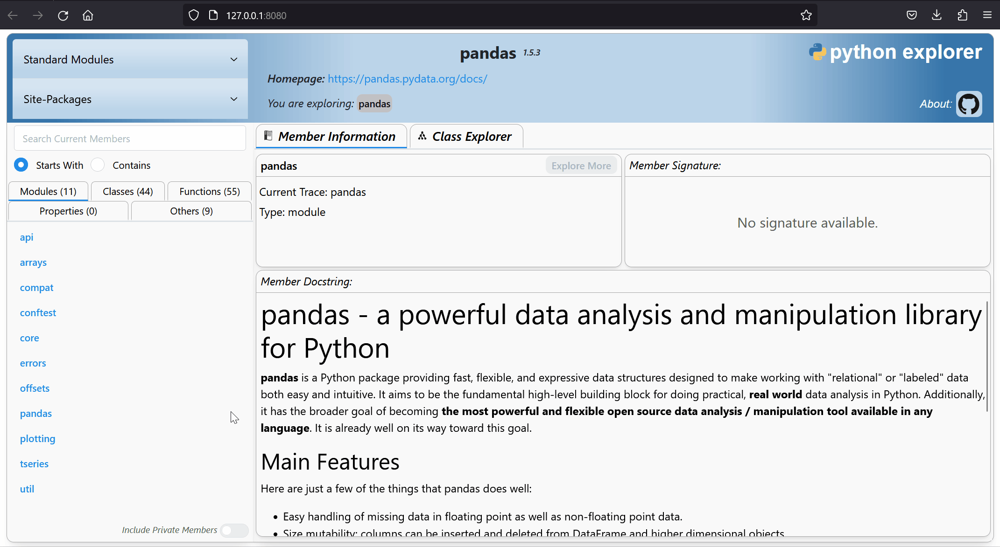
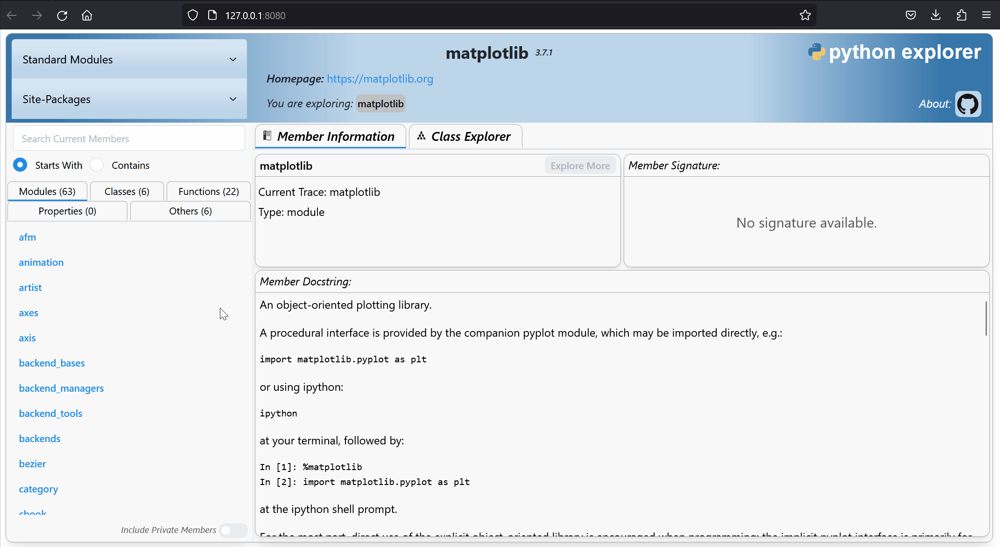

# Python Explorer

Developmental build of an experimental python object exploration tool and interface. Please check out the about section below for some basic functionality of the tool. 

Built with python using [Dash](https://dash.plotly.com) and deployed with [Render](https://render.com).

Beta version can be accessed here: [python-explorer](https://python-explorer.onrender.com/). Let me know what you think or if you found this useful!

Motivation
----------
This idea stems from my own curiosity about existing python packages both as a beginner and as someone who tends to want to know why something is the way that it is. When presented with new packages, I felt we generally have two options to learn about them: read the docs or explore the raw code. This tool is intended to live somewhere in the middle of those two options. This will definitely **not** be a replacement for the primary documentation of a package, nor will it give you all the information possible by going to the source code. 

My hope is to quickly answer questions like what are the basic parts of a package? What are all the functions or things that are available for a given object? How do the pieces fit together? 

Like the name implies, this is an exploration. The information provided is only as good as the documentation in the code, so some items may not have any information and some packages may be super confusing without more context. 

Oftentimes, the only reason we know about a certain class/function/method is because we had a direct need for it and googled a similar example. While useful in the moment, this can result in a lack of awareness for other potentially useful portions of the code. Having a tool that allows you to quickly scan through a listing of available things generally encourages further curiosity and understanding.... this is my current goal.

About The Tool
--------------
### Getting Started
Use the menu in the upper left corner and choose something to explore. I have included the standard modules (Python 3.10) and some common data packages for now. 

### Explore More
The Explore More button (center top of Member Information tab) allows you to step into certain objects such as modules or classes. You can keep going further into a particular space until it recognizes that there is nothing further to explore.

### Navigation
As you explore objects, the tool will keep track of where you are in the navigation listing (top of page). Just click one of the previous object buttons to return to that state.

### Search Members
For a given space, the search input allows you to filter the members by members that either start with or contain the input text. This helps narrow down options or helps you find something quicker if you know the name already.

### Class Explorer
The Class Explorer tab opens up a cytoscape graph of the current classes for a given space and their associated relationships. The graph includes the super classes of the given list and so may include classes that are outside the current namespace. The layout dropdown menu lets you choose different layout options or you can move and organize the results as you please.

Both the Member Information tab and the Class Explorer tab are active in the background so feel free to switch back and forth between them. NOTE: the search feature does not currently affect the cytoscape output.

Future
------
I would like to keep improving and learning about the various aspects I have seen so far. The deployed version of the app is pretty limited on the server side as I am just using an entry level option right now, but I am definitely happy with the result so far. Deploying it on Render was super easy for someone just learning and it seemed like the easiest way to share an initial version. If anything, this has been a great project and learning experience for myself. I am definitely open to suggestions for improvements, ideas, collaboration interest, etc.

#### Current Ideas:
* I think it would be nice to have standard listings from previous python versions as well. The current list is held in a static text file so you could maybe choose from other files to refresh the package listing in the drawer. Running from a single version of python certainly complicates the functionality of this concept. 
* It would also be cool to have the user add in other packages that they would like to explore (more challenging in this kind of environment since everything is preloaded on the server side). Not sure if something like this is possible, but maybe. I think eventually this may make more sense as a local install where the gui is started from the CLI to run locally in the browser. The options then to allow the user to explore their own set of desired packages becomes a lot easier.
* Open to suggestions on the cytoscape formatting. I didn't think too hard about it, but would like to have better color contrast and clarity as to what is being represented.
* I quickly found that absolutely nothing is consistent when it comes to docstrings, so if someone has a more robust (and safe) way of displaying a variety of docstring inputs, I'm all ears. 
